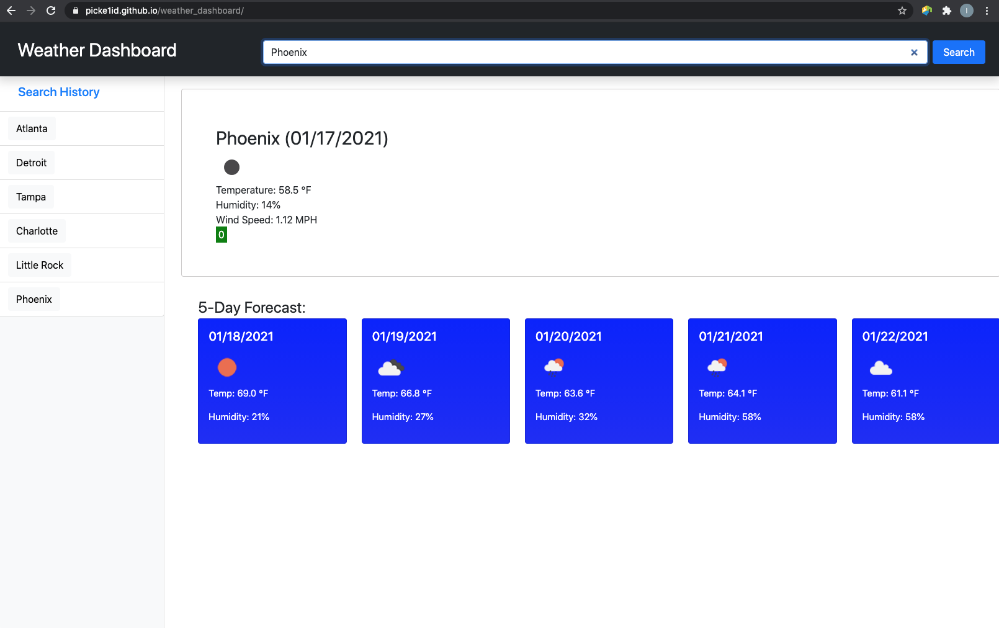

# Weather Dashboard
This site was developed with the intention of creating a weather dashboard that utilizes the OpenWeather API to retrieve weather data for searched cities.

## Motivation
The motivation behind this project was to create a weather dashboard that uses an API to fetch weather data and save pieces of information to local storage, all while utilizing updated HTML and CSS powered by JQuery.

## Tech/Framework Used
* Dynamically updated HTML and CSS powered by JQuery
* Boostrap CSS
* OpenWeather API
* Moment.js library
* Built with Visual Code Studio

## Code Example
Here is an example of the planner layout:

## Features
* Ability to search city and retrieve current weather, as well as 5-day forecast.
* Color coding that indicates whether the UV index is favorable, moderate, or severe.
* Search history that stores recently searched cities.

## Installation
Clone this repository to your machine or download zip file.

## Usage
After the repository has been cloned, click on the index.html and open in browser. 

## License 
> You can reference the full license [here](https://github.com/Picke1id/weather_dashboard/blob/main/LICENSE).

This project is licensed under the terms of the MIT license.
